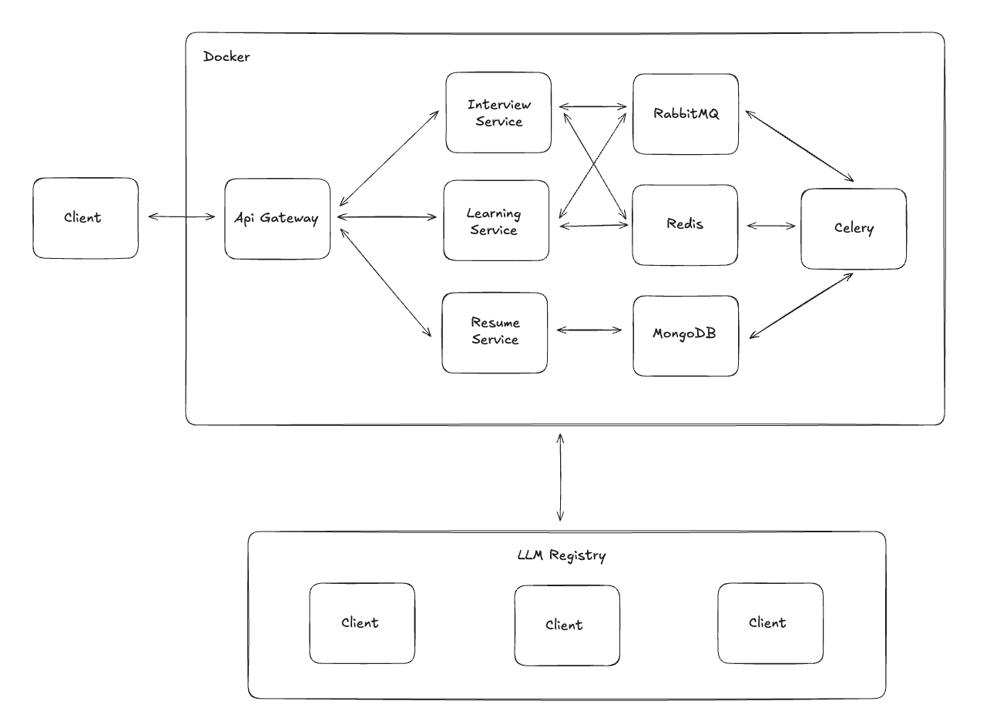

# AI Challenge: 이력서 기반 맞춤형 커리어 코치 챗봇 API

구직자의 이력서를 분석하여 개인 맞춤형 면접 질문과 학습 경로를 제공하는 AI 기반 백엔드 서비스입니다.  
## 목차
- [API 사용 가이드](#api-사용-가이드)
- [시스템 아키텍처](#시스템-아키텍처)
- [LLM 가이드](#llm-가이드)
- [프롬프팅 전략](#프롬프팅-전략)
- [AI 협업 가이드](#ai-협업-가이드)
- [테스트 전략](#테스트-전략)
- [에러 처리 가이드](#에러-처리-가이드)
- [향후 확장 계획](#향후-확장-계획)
---

# API 사용 가이드

> AI Challenge API의 엔드포인트

## 요구사항

### 1. 이력서 핵심 정보 입력
### 2. 맞춤형 면접 질문 생성
### 3. 개인 맞춤형 학습 경로 생성


## API 엔드포인트

### Resume Service
- `POST /api/v1/resumes/` - 이력서 생성
- `GET /api/v1/resumes/{unique_key}` - 이력서 조회
- `GET /api/v1/resumes/` - 이력서 목록 조회
- `PUT /api/v1/resumes/{unique_key}` - 이력서 수정
- `DELETE /api/v1/resumes/{unique_key}` - 이력서 삭제

### Interview Service
- `POST /api/v1/interview/{unique_key}/questions` - 면접 질문 생성
- `GET /api/v1/interview/{unique_key}/questions` - 면접 질문 조회
- `GET /api/v1/interview/health` - 서비스 헬스체크

### Learning Service
- `POST /api/v1/learning/{unique_key}/learning-path` - 학습 경로 생성
- `GET /api/v1/learning/{unique_key}/learning-path` - 학습 경로 조회
- `GET /api/v1/learning/health` - 서비스 헬스체크

## 응답 결과
### 1. 입력 데이터

**핵심 경력 요약:**
- **경력**: 4개월 (인턴십)
- **주요 프로젝트**: 
  - 주식 시세 서비스 (Kafka, MSA, API Gateway)
  - TecheerZip 커뮤니티 플랫폼 (Spring Boot, RabbitMQ, Redis)
- **기술 스택**: Kafka, Spring Boot, PostgreSQL, RabbitMQ, Redis, Docker, AWS/GCP

**전체 이력서 데이터**: [`resume-example.json`](./resume-example.json)
### 2. 면접 질문 

**생성된 질문 (5개):**

1. **Reliability, Kafka, MSA** (난이도: Medium)
   - **질문**: 주식 시세 서비스에서 마이크로서비스 장애 시 실시간 시세 제공 영향과 대응 방안
   - **핵심 요소**: 서킷 브레이커, 장애 감지/복구, 데이터 일관성

2. **Scalability, Redis** (난이도: Medium)
   - **질문**: 동시 접속자 10배 증가 시 Redis 병목 지점과 확장 전략
   - **핵심 요소**: Redis 클러스터/샤딩, 성능 모니터링, 캐싱 전략

3. **Trade-off, Kafka, RabbitMQ** (난이도: Hard)
   - **질문**: TecheerZip(RabbitMQ) vs 주식 서비스(Kafka) 기술 선택 근거와 트레이드오프
   - **핵심 요소**: 아키텍처 차이, 사용 사례, 처리량/내구성/순서 보장

4. **Implementation, MSA, API Gateway** (난이도: Medium)
   - **질문**: FastAPI 환경에서 API Gateway 라우팅 로직 구현과 서비스 디스커버리
   - **핵심 요소**: 리버스 프록시, 라우팅 테이블, 부하 분산

5. **Quality, RabbitMQ, Testing** (난이도: Medium)
   - **질문**: 비동기 메시지 처리 시스템 안정성 보장을 위한 테스트 전략
   - **핵심 요소**: Producer/Consumer 테스트, 멱등성 보장, 비동기 디버깅

**전체 응답 데이터**: [`interview-example.json`](./interview-example.json)
### 3. 학습 경로

**분석 결과:**
- **강점**: MSA 구현, 메시지 큐 활용, 클라우드 최적화 경험
- **약점**: 운영/모니터링, 고급 분산 시스템 설계, DB 최적화, 보안/테스트 부족

**추천 학습 경로 (5개):**

**강점 심화 (2개):**
1. **Kafka 고급 패턴 및 분산 트랜잭션**
   - Event Sourcing, Saga 패턴 학습
   - Kafka Streams 활용

2. **클라우드 네이티브 아키텍처 및 쿠버네티스**
   - 컨테이너 오케스트레이션(K8s) 학습
   - AWS EKS, Helm 활용

**약점 보완 (3개):**
3. **분산 시스템 모니터링 및 로깅**
   - Prometheus, Grafana, ELK Stack 구축
   - MSA 환경 모니터링 체계

4. **관계형 데이터베이스 고급 최적화 및 설계**
   - SQL 성능 튜닝, 인덱싱, 복제
   - 대규모 환경 고가용성 설계

5. **API 보안 및 견고한 시스템 테스트**
   - OAuth 2.0, JWT, Spring Security
   - 분산 시스템 테스트 전략

**전체 응답 데이터**: [`learning-example.json`](./learning-example.json) 
## 개발 환경 설정

### 1. Hosts 파일 설정
```bash
# /etc/hosts에 추가
127.0.0.1 api.localhost
```

#### **서브도메인 설정**
- **API Gateway 주소**: `http://api.localhost`
- **Hosts 파일 설정 필요**: `/etc/hosts`에 `127.0.0.1 api.localhost` 추가
- api.localhost는 개발을 위한 설정이기 때문에 추후 도메인 연결이 필요합니다. 
- **서비스 접근**:
  - Resume API: http://api.localhost/api/v1/resumes/docs
  - Interview API: http://api.localhost/api/v1/interview/docs  
  - Learning API: http://api.localhost/api/v1/learning/docs
  - 통합 테스트 페이지: http://api.localhost/test
  - Traefik Dashboard: http://localhost:8080

### 2. 환경변수 설정
`.env` 파일에 다음 환경변수들을 설정해야 합니다:

- **MongoDB**: `MONGODB_URL`, `DATABASE_NAME`, `MONGO_INITDB_ROOT_USERNAME`, `MONGO_INITDB_ROOT_PASSWORD`
- **OpenAI**: `OPENAI_API_KEY` 등 OpenAI 관련 설정
- **Claude**: `CLAUDE_API_KEY` 등 Claude 관련 설정  
- **Gemini**: `GEMINI_API_KEY` 등 Gemini 관련 설정
자세한 설정은 [`env.example`](./env.example) 파일을 참고하세요. 

### 3. 서비스 시작
```bash
docker compose up -d
```

### 4. API 문서 확인
#### Swagger 
- Resume API: http://api.localhost/api/v1/resumes/docs
- Interview API: http://api.localhost/api/v1/interview/docs  
- Learning API: http://api.localhost/api/v1/learning/docs

#### **비동기 테스트 페이지 (`http://api.localhost/test`)**
- **통합 테스트 UI**: 브라우저에서 바로 접속하여 전체 기능 테스트
- **서비스 선택**: Interview (면접 질문) / Learning (학습 경로) 서비스 전환
- **실시간 진행률**: SSE를 통한 실시간 작업 진행 상황 모니터링
- **결과 시각화**: 생성된 면접 질문 및 학습 경로의 구조화된 표시

#### **모니터링 도구**
- **Flower Dashboard**: `http://localhost:5555` (Celery 작업 모니터링)
- **Traefik Dashboard**: `http://localhost:8080` (API Gateway 라우팅 상태)
- **API 문서**: 각 서비스별 Swagger UI 제공

# 시스템 아키텍처

> AI Challenge - Interview Preparation API의 시스템 아키텍처 및 설계 원칙

## 시스템 아키텍처 



## 아키텍처 구성 요소

### **마이크로서비스 (FastAPI)**
- **Resume Service (Port 8001)**: 이력서 CRUD 관리
- **Interview Service (Port 8002)**: AI 기반 면접 질문 생성
- **Learning Service (Port 8003)**: AI 기반 학습 경로 생성

### **Shared Module**
- **LLM Registry**: 다중 AI 모델 관리 및 폴백 처리
- **Database Connection**: MongoDB 연결 풀 관리
- **Common Utilities**: 공통 로깅, 에러 처리, 설정 관리

### **데이터 레이어**
- **MongoDB**: 유연한 스키마로 다양한 이력서 형태 지원
- **Collections**: resumes, interviews, learning_paths

### **AI 레이어**
- **OpenAI GPT-4.1**: 빠르고 일관된 품질의 기본 모델
- **Claude 3.5 Sonnet**: 창의적이고 상세한 고품질 응답
- **Gemini 1.5 Flash**: 무료 모델로 비용 최적화

### **비동기 처리 레이어**
- **Celery**: 백그라운드 작업 큐 시스템으로 LLM 작업 처리
- **RabbitMQ**: 메시지 브로커로 작업 큐 관리
- **Redis**: Celery 결과 백엔드 및 진행률 추적
- **SSE (Server-Sent Events)**: 실시간 진행률 업데이트

### **인프라 레이어**
- **Docker Compose**: 로컬 개발 환경 통합 관리
- **Traefik**: API Gateway 기반 라우팅 및 로드밸런싱

## 데이터 흐름 (Data Flow)

### **동기 처리 (Synchronous)**
1. **이력서 등록**: Client → Resume Service → MongoDB
2. **면접 질문 생성 (동기)**: Client → Interview Service → LLM → MongoDB

### **비동기 처리 (Asynchronous)**
1. **면접 질문 생성 (비동기)**:
   - Client → Interview Service → Celery Task → RabbitMQ Queue
   - Celery Worker → LLM API → MongoDB
   - 진행률 추적: Redis → SSE → Client (실시간 업데이트)

2. **학습 경로 생성 (비동기)**:
   - Client → Learning Service → Celery Task → RabbitMQ Queue
   - Celery Worker → LLM API → MongoDB
   - 진행률 추적: Redis → SSE → Client (실시간 업데이트)

3. **폴백 처리**: LLM 실패 시 자동으로 다른 Provider로 전환
4. **실시간 모니터링**: Flower Dashboard로 Celery 작업 상태 확인

## 기술 스택 선정 이유

### **FastAPI (Python)**
- **비동기 처리**: async/await 지원으로 I/O 바운드 작업 최적화
- **생태계**: LangChain, OpenAI SDK 등 AI 라이브러리와 완벽 호환

### **MongoDB**
- **스키마 유연성**: 다양한 형태의 이력서 데이터 저장
- **JSON 친화적**: FastAPI와 자연스러운 통합
- **확장성**: 샤딩 및 레플리카셋 지원

### **Celery (워커)**
- **비동기 처리**: LLM API 호출같은 시간이 오래 걸리는 작업을 백그라운드에서 처리
- **분산 처리**: 여러 워커에서 병렬로 작업 실행 가능
- **재시도 메커니즘**: 실패한 작업 자동 재시도로 안정성 보장
- **Python 생태계**: FastAPI와 완벽한 통합

### **RabbitMQ (메시지 브로커)**
- **안정성**: 메시지 지속성(persistence)으로 작업 손실 방지
- **라우팅**: 복잡한 메시지 라우팅 패턴 지원
- **확장성**: 클러스터링으로 고가용성 구현
- **표준 준수**: AMQP 프로토콜 기반으로 언어 독립적

### **Redis (결과 백엔드 & 캐시)**
- **고성능**: 인메모리 저장으로 빠른 응답 속도
- **진행률 추적**: 실시간 작업 상태 및 진행률 저장
- **결과 캐싱**: Celery 작업 결과의 임시 저장소
- **SSE 지원**: 실시간 클라이언트 알림을 위한 데이터 소스

## 확장성을 고려한 아키텍처 설계: MSA

### 현재 구현된 마이크로서비스 구조:

```
backend/
├── shared/                    # 공통 모듈
│   ├── config/base.py            # 통합 설정 관리
│   ├── database/connection.py    # MongoDB 연결 관리
│   ├── llm/                      # LLM 클라이언트 추상화
│   │   ├── base.py              # 추상 기본 클래스
│   │   ├── openai_client.py     # OpenAI GPT 클라이언트
│   │   ├── claude_client.py     # Anthropic Claude 클라이언트
│   │   ├── gemini_client.py     # Google Gemini 클라이언트
│   │   └── registry.py          # LLM 레지스트리 & 폴백
│   └── utils/                   # 공통 유틸리티
│
├── resume-service/            # 이력서 관리 서비스
│   ├── src/routes.py            # REST API 엔드포인트
│   ├── src/crud.py              # 데이터베이스 CRUD
│   └── main.py                  # 서비스 엔트리포인트
│
├── interview-service/         # 면접 질문 생성 서비스
│   ├── src/routes.py            # REST API 엔드포인트
│   ├── src/service.py           # 비즈니스 로직
│   ├── src/crud.py              # 데이터베이스 CRUD
│   └── main.py                  # 서비스 엔트리포인트
│
└── learning-service/          # 학습 경로 생성 서비스
    ├── src/routes.py            # REST API 엔드포인트
    ├── src/service.py           # 비즈니스 로직
    └── main.py                  # 서비스 엔트리포인트
```

### MSA 설계 원칙:
1. **단일 책임**: 각 서비스는 하나의 비즈니스 도메인만 담당
2. **데이터 독립성**: 각 서비스가 독립적인 데이터베이스 접근
3. **API 게이트웨이**: Traefik 기반 라우팅 및 로드밸런싱
4. **서비스간 통신**: REST API 기반 (향후 gRPC 고려)
5. **공통 모듈**: shared 폴더로 코드 재사용성 극대화

# LLM 가이드

> 다중 LLM 모델 통합 및 폴백 전략

## 다중 모델 지원 현황

### 구현된 LLM Provider들:

| Provider | 모델명 | 특징 | 토큰당 가격 | 기본 모델 |
|----------|--------|------|-------------|----------|
| **Gemini** | `gemini-2.5-flash` | 무료, 빠른 처리, 기본 모델 | 무료 | **기본** |
| **OpenAI** | `gpt-4.1` | 빠른 응답, 일관성 있는 품질 | $0.0015/1K tokens | 폴백 1순위 |
| **Claude** | `claude-3-5-sonnet-20241022` | 창의적이고 상세한 응답 | $0.003/1K tokens | 폴백 2순위 | 

### 한 이력서당 예상 비용:
- **면접 질문 생성**: ~500 토큰 사용
  - OpenAI: $0.00075
  - Claude: $0.0015
  - Gemini: 무료
- **학습 경로 생성**: ~800 토큰 사용
  - OpenAI: $0.0012
  - Claude: $0.0024
  - Gemini: 무료

## 우선순위 및 폴백 전략

### 구현된 LLM Registry 시스템:

<details>
<summary>LLM Registry 구현 코드</summary>

```python
# backend/shared/llm/registry.py 
class LLMRegistry:
    def register(self, name: str, client_class: Type[LLMClient])
    def create_client(self, name: str) -> Optional[LLMClient]
    def get_client(self, name: str) -> Optional[LLMClient]
    def get_client_with_fallback(self) -> Optional[LLMClient]
    def get_available_clients(self) -> List[str]

registry = LLMRegistry()
preferred_order = ["gemini", "openai", "claude"]
```

</details>

### 폴백 시나리오
1. **기본 모델 (Gemini)** → 무료 모델로 먼저 시도
2. **자동 폴백 체인** → 실패 시 Gemini → OpenAI → Claude 순서로 시도
3. **모든 Provider 실패** → 명확한 에러 메시지와 함께 HTTP 500 반환

### 모델 관리 
- **Provider Registry**: 새로운 LLM 추가 시 최소 코드 변경 (현재 OpenAI, Claude, Gemini 운영)
- **설정 기반**: 환경변수로 모델별 파라미터 조정 (API키, 온도, 토큰수, 타임아웃)
- **추상화 계층**: LLMClient 베이스 클래스로 일관된 인터페이스 제공
-  **실시간 폴백**: Provider 장애 시 1초 내 자동 전환

## LangChain 활용
- **추상화**: 다양한 LLM Provider 통합 인터페이스 (OpenAI, Claude, Gemini)
- **메시지 체인**: SystemMessage + HumanMessage로 구조화된 프롬프트
- **스트리밍**: 실시간 응답 스트리밍 지원 (`ainvoke`, `astream` 메소드)
- **에러 핸들링**: 폴백 설정으로 LLM Provider 장애시에도 안정적으로 서비스 제공 가능
- **비동기 처리**: async/await 패턴으로 동시 처리 최적화

# 프롬프팅 전략

> AI Challenge API의 고도화된 프롬프트 엔지니어링 전략

## 목표: 개인 맞춤형의 특징 살리기

### 전체 시스템 개요:
이력서 정보를 바탕으로 **면접 질문 생성**과 **학습 경로 추천** 두 가지 핵심 기능을 제공합니다.

### 공통 프롬프트 전략:
1. **개인맞춤형 근거 제시**: 각 질문과 학습 경로의 제시 이유를 구체적으로 설명
2. **실무 중심 접근**: 이론적 지식보다 실제 업무 경험과 문제해결 능력 중심
3. **프롬프트 실험 및 최적화**: Playground에서 다양한 프롬프트 패턴을 반복 실험하여 최적화

---

# 1. 면접 질문 생성 프로세스

## 프로세스 플로우:
```
이력서 분석 → 질문 유형 선정 → 개인맞춤 질문 생성 → 품질 검증 → 5개 질문 출력
```

## 핵심 전략:

### **다차원 질문 유형 체계**

<details>
<summary>8가지 질문 유형 체계</summary>

**구현된 질문 유형들:**
1. **Implementation**: 구체적 구현 방법 (예: "WebSocket 연결 상태 관리를 어떻게 구현하셨나요?")
2. **Trade-off**: 설계 결정과 트레이드오프 (예: "Spring Cloud Gateway vs Nginx 선택 기준은?")
3. **Performance**: 성능 최적화 경험 (예: "Virtual Thread 도입 후 성능 지표 변화는?")
4. **Reliability**: 장애 대응과 안정성 (예: "Redis 다운 시 실시간 채팅 영향과 대응 방안은?")
5. **Scalability**: 확장성과 운영 (예: "동시 사용자 10배 증가 시 병목과 해결책은?")
6. **Quality**: 코드 품질과 테스트 (예: "비동기 메시지 처리 테스트 전략은?")
7. **Collaboration**: 협업과 의사결정 (예: "MSA API 스펙 팀 협의 과정은?")
8. **Business**: 비즈니스 이해도 (예: "실시간 채팅이 매칭 플랫폼에 핵심인 이유는?")

**Before vs After:**
- **기존**: "Kafka를 왜 사용하셨나요?" (단순 기술 질문)
- **개선**: "Kafka 토픽 설계와 Consumer group 구성 기준, 데이터 유실 방지 방안은?" (실무 구현 세부사항)

</details>

### **실무 시나리오 기반 질문 설계**
- **운영 상황 시뮬레이션**: "실제 서비스 운영 중 ○○ 장애 발생 시..." 
- **확장성 검증**: "트래픽 10배 증가 시 병목 지점과 해결 전략..."
- **의사결정 과정 탐구**: "기술 선택의 근거와 대안 검토 과정..."

### **프로젝트 심층 분석 방향**
- **구현 세부사항**: "단순히 Redis 사용이 아닌 어떤 데이터 구조를 어떻게 활용했는지"
- **기술적 도전**: "마이크로서비스 간 데이터 일관성 보장 방법"
- **성과 측정**: "Virtual Thread 도입으로 어떤 메트릭이 얼마나 개선되었는지"

## 면접 질문 생성 성과

<details>
<summary>실제 생성된 질문 예시</summary>

**Before (기존 단순 패턴):**
```
- "Kafka를 왜 사용하셨나요?"
- "Redis의 장점이 무엇인가요?"
```

**After (개선된 다차원 질문):**
```
1. Implementation: "Kafka의 토픽 설계는 어떻게 하셨고, Consumer group은 어떤 기준으로 구성하셨나요? 데이터가 유실되지 않도록 어떤 방안을 적용하셨는지..."

2. Trade-off: "모놀리식 아키텍처 대신 MSA를 선택하신 주된 이유는 무엇인가요? MSA 도입으로 인한 복잡성은 어떻게 관리하셨는지..."

3. Reliability: "RabbitMQ 서버가 예기치 않게 다운되면 크롤링 요청들은 어떻게 되며, 어떤 복구 전략을 설계하셨나요?"
```

**품질 개선 지표:**
- 질문 다양성: 단일 패턴 → 8가지 유형 골고루 분포
- 실무 적합성: 이론적 질문 → 실제 경험 검증 질문
- 개인맞춤성: 일반적 질문 → 구체적 프로젝트 기반 질문

</details>

---

# 2. 학습 경로 추천 프로세스

## 프로세스 플로우:
```
이력서 분석 → 장점/단점 식별 → 학습 우선순위 설정 → 개인맞춤 학습 경로 생성 → 3-8개 경로 출력
```

## 핵심 전략:

### **3단계 체계적 분석**

<details>
<summary>장점/단점 분석 프로세스</summary>

**1단계: 장점 식별**
- 프로젝트 성과 및 기술적 차별화 포인트 분석
- 경력 대비 뛰어난 기술 활용도 평가
- 업계에서 인정받을 만한 경험 및 성취 파악

**2단계: 단점 식별**
- 경력 수준 대비 부족한 기술 영역 진단
- 현재 시장 요구사항과의 Gap 분석
- 향후 성장을 위해 보완이 필요한 역량 파악

**3단계: 학습 방향 설정**
- **강점 심화**: 이미 보유한 강점을 전문성 수준으로 발전
- **약점 보완**: 부족한 영역을 시장 요구 수준으로 향상
- **균형잡힌 조합**: 강점 60% + 약점 보완 40% 비율

</details>

### **학습 경로 구조화**

각 학습 경로는 다음 정보를 포함합니다:
- **Type**: `strength` (강점 심화) 또는 `weakness` (약점 보완)
- **Title**: 구체적인 학습 주제
- **Description**: 학습 목표 및 예상 성과
- **Reason**: 해당 학습을 추천하는 개인맞춤형 근거
- **Resources**: 추천 학습 방법 및 리소스
- **Link**: 관련 학습 자료 링크

## 학습 경로 추천 성과

**개선 전 vs 개선 후:**
- **기존**: "Spring Boot 공부하세요" (일반적 추천)
- **개선**: "이미 Spring Boot 기반 MSA 구축 경험이 뛰어나므로, Spring Cloud Gateway 기반 API Gateway 패턴 전문성을 강화하여 아키텍트 역량 발전" (개인맞춤형 근거)

---

# 3. 공통 구현 전략

## 프롬프트 구조화

### YAML 기반 프롬프트 관리
```yaml
# interview-service/prompts/interview_questions.yaml
name: "interview_questions_generation"
version: "3.0.0"
description: "백엔드 개발자 대상 개인 맞춤형 기술 면접 질문 생성 프롬프트"

guidelines:
  - 목적: 지원자의 실무 역량·문제 해결력을 검증하는 '개인 맞춤형' 질문을 생성한다.
  - 입력: 이력서 JSON(경력, 프로젝트, 기술 스택).
  - 출력: JSON 스키마에 맞춘 5개의 질문 세트.

system_prompt_template: |
  당신은 백엔드 개발자 채용 전문 기술 면접관입니다.
  주어진 이력서 정보를 바탕으로 지원자의 실무 역량과 문제 해결력을 검증하는 개인 맞춤형 면접 질문 5개를 생성해주세요.

human_prompt_template: |
  지원자 정보:
  이름: {name}
  경력: {experience_months}개월
  
  프로젝트 경험:
  {projects}
  
  위 프로젝트 경험을 바탕으로 실제 면접에서 나올 법한 다양한 유형의 질문 5개를 생성해주세요.

output_schema:
  questions:
    - difficulty: string     # easy|medium|hard
      topic: string          # 주요 기술 키워드
      type: string           # 8가지 질문 유형 중 하나
      question: string       # 실제 질문 본문
      what_good_answers_cover: [string]   # 좋은 답변이 포함해야 할 핵심 요소
```

### Few-Shot Learning 적용
```yaml
examples:
  - input:
      name: "김개발"
      tech_stack: ["Spring Boot", "Redis", "MySQL"]
      project: "커머스 API 개발"
    output:
      question: "Spring Boot 기반 커머스 API에서 Redis를 캐시로 활용하실 때, 캐시 무효화 전략은 어떻게 설계하셨나요? 특히 상품 정보 업데이트 시 일관성을 어떻게 보장하셨는지..."
      type: "Implementation"
      difficulty: "medium"
```

### JSON Schema 강제
```yaml
response_format:
  type: "json_object"
  schema:
    type: "object"
    properties:
      questions:
        type: "array"
        items:
          type: "object"
          properties:
            difficulty: { "type": "string", "enum": ["easy", "medium", "hard"] }
            topic: { "type": "string" }
            type: { "type": "string" }
            question: { "type": "string" }
          required: ["difficulty", "topic", "type", "question"]
    required: ["questions"]
```

## Chain-of-Thought 추론

### 단계별 추론 과정
```
1. 이력서 분석: 
   - 기술 스택 파악
   - 프로젝트 복잡도 평가
   - 경력 수준 확인

2. 질문 카테고리 선정:
   - 8가지 유형 중 적합한 5가지 선택
   - 난이도 분배 (easy:1, medium:3, hard:1)

3. 개인맞춤화:
   - 구체적 프로젝트 경험 언급
   - 실무 상황 시뮬레이션
   - 기술적 의사결정 과정 탐구

4. 품질 검증:
   - 질문 다양성 확인
   - 실무 적합성 검토
   - 개인맞춤성 정도 평가
```

## 동적 난이도 조정

### 경력별 난이도 매트릭스
```python
DIFFICULTY_MATRIX = {
    "junior": {  # 0-24개월
        "easy": 2,
        "medium": 2, 
        "hard": 1
    },
    "mid": {     # 24-60개월
        "easy": 1,
        "medium": 3,
        "hard": 1
    },
    "senior": {  # 60개월+
        "easy": 0,
        "medium": 2,
        "hard": 3
    }
}
```

### 기술 스택 복잡도 가중치
```python
TECH_COMPLEXITY_WEIGHT = {
    "basic": ["HTML", "CSS", "JavaScript"],           # +0
    "intermediate": ["React", "Node.js", "MySQL"],    # +1
    "advanced": ["Kubernetes", "Kafka", "Redis"],     # +2
    "expert": ["Istio", "Consul", "Elasticsearch"]    # +3
}
```

# AI 협업 가이드

> 프로젝트를 개발하는 과정에서 AI를 효율적으로 활용하고, 협업을 위한 컨벤션으로 활용하기 위해 rules을 설정했습니다. [Cursor Rules Guide](https://github.com/PatrickJS/awesome-cursorrule) 를 참고하여 만들었습니다.

## AI 설정 파일 구조
```
AI-Challenge/
├── .claude/
│   └── setting.json          # Claude AI 컨텍스트 설정
├── .cursor/
│   └── rules/ 
├── copilot-instructions.md   # GitHub Copilot 가이드라인
└── AI-COLLABORATION.md       # 이 파일
```

## 실전 활용 팁

### Claude와의 효과적인 대화법
```markdown
Good:
"현재 interview_service.py의 generate_questions 함수에서 
LLM API 호출 실패 시 재시도 로직을 구현하고 싶습니다.
현재 코드 구조와 에러 처리 패턴을 고려해서 
어떤 방식이 가장 적절할까요?"

Avoid:
"코드 좀 고쳐줘"
```

### Copilot 프롬프트 최적화
```python
# 구체적인 요구사항을 주석으로 명시
# "Generate async function to validate resume data with:
# - Input: dict (resume data from MongoDB)
# - Output: ValidationResult (custom Pydantic model)  
# - Validation: required fields, data types, business rules
# - Error handling: raise ValidationError with detailed message"

async def validate_resume_data(resume_data: dict) -> ValidationResult:
    # Copilot이 여기서 구현...
```

### Cursor 컨텍스트 활용
```
1. 관련 파일들을 모두 열어두기
2. @filename 으로 특정 파일 참조
3. 전체 프로젝트 구조 인식 활용
4. 일관된 네이밍 패턴 유지
```

# 테스트 전략

> AI Challenge API의 종합적인 테스트 전략 및 구현

## 테스트 전략 개요

### **Given-When-Then 패턴 (BDD)**

<details>
<summary>BDD 테스트 예시</summary>

```python
def test_generate_interview_questions():
    # Given: 유효한 이력서 데이터가 주어지고
    resume_data = {"name": "김개발", "tech_skills": ["Python", "FastAPI"]}
    
    # When: 면접 질문 생성을 요청하면 (Gemini 기본 사용)
    response = client.post(f"/interview/{unique_key}/questions")
    
    # Then: 5개의 면접 질문이 생성된다
    assert response.status_code == 200
    assert len(response.json()["questions"]) == 5
    assert all("question" in q for q in response.json()["questions"])
```

</details>

### **Table Driven Test**
다양한 시나리오를 효율적으로 테스트:

<details>
<summary>파라미터화된 테스트 예시</summary>

```python
@pytest.mark.parametrize("unique_key,resume_type,expected_questions", [
    ("test_junior", "신입개발자", 5),
    ("test_senior", "시니어개발자", 5),
    ("test_fullstack", "풀스택개발자", 5),
    ("invalid_key", "존재하지_않는_키", None),
])
def test_resume_based_question_generation(unique_key, resume_type, expected_questions):
    # Given: 다양한 유형의 이력서가 주어지고
    # When: 면접 질문 생성을 요청하면 (Gemini 기본 사용)
    response = client.post(f"/interview/{unique_key}/questions")
    
    # Then: 예상된 결과를 반환한다
    if expected_questions:
        assert response.status_code == 200
        assert len(response.json()["questions"]) == expected_questions
        assert response.json()["provider"] == "gemini"
    else:
        assert response.status_code == 404
```

</details>

### **Flaky Test 대응 전략**

<details>
<summary>Flaky Test 대응 전략</summary>

#### **자동 재실행 (Rerun)**
```python
# pytest-rerunfailures 사용
@pytest.mark.flaky(reruns=3, reruns_delay=2)
def test_llm_api_call():
    """LLM API 호출 테스트 - 네트워크 이슈로 인한 실패 시 재시도"""
    response = client.post("/interview/test_user/questions")
    assert response.status_code == 200
    assert response.json()["provider"] in ["gemini", "openai", "claude"]  # 폴백 허용
```

#### **병렬 실행 (Parallel)**
```python
# pytest-xdist 사용
# 테스트 실행: pytest -n auto (CPU 코어 수만큼 병렬 실행)

@pytest.mark.parametrize("unique_key", [
    "user1_1", "user2_1", "user3_1", "user4_1", "user5_1"
])
def test_concurrent_interview_generation(unique_key):
    """동시 다발적 면접 질문 생성 테스트"""
    response = client.post(f"/interview/{unique_key}/questions")
    assert response.status_code == 200
```

#### **Timeout 및 Retry 로직**
```python
@pytest.mark.timeout(30)  # 30초 타임아웃
@pytest.mark.retry(max_attempts=3, backoff=1.5)
def test_learning_path_generation():
    """학습 경로 생성 테스트 - 타임아웃 및 재시도"""
    response = client.post("/learning/test_user/learning-path")
    assert response.status_code == 200
```

</details>

### **Celery 파이프라인 테스트**

<details>
<summary>Celery 파이프라인 테스트 예시</summary>

#### **기본 설정 및 픽스처**
```python
@pytest.fixture
def mock_celery_task():
    with patch('celery.Task') as mock:
        mock.return_value.delay.return_value = AsyncResult('test-id')
        yield mock

@pytest.fixture
def mock_redis():
    with patch('redis.Redis') as mock:
        mock.return_value.get.return_value = b'{"status": "completed"}'
        yield mock

@pytest.fixture
def mock_rabbitmq():
    with patch('kombu.Connection') as mock:
        yield mock
```

#### **면접 질문 생성 파이프라인**
```python
@pytest.mark.asyncio
async def test_interview_pipeline(mock_celery_task, mock_redis):
    """면접 질문 생성 파이프라인 테스트"""
    # Given: 이력서 데이터가 주어지고
    resume_data = {
        "name": "테스트개발자",
        "technical_skills": ["Python", "FastAPI"]
    }
    
    # When: 태스크를 실행하면
    result = generate_interview_questions.delay(resume_data)
    
    # Then: 태스크가 큐에 들어가고 결과가 저장된다
    assert result.id == 'test-id'
    stored_result = mock_redis.return_value.get(
        f'interview:result:{result.id}'
    )
    assert stored_result is not None
```

#### **태스크 체인 테스트**
```python
def test_chain_tasks(mock_celery_task):
    """태스크 체인 테스트"""
    # Given: 태스크 체인이 구성되고
    task_chain = chain(
        preprocess_resume.s({"name": "테스트"}),
        generate_interview_questions.s(),
        post_process_questions.s()
    )
    
    # When: 체인을 실행하면
    result = task_chain.delay()
    
    # Then: 모든 태스크가 순차적으로 실행된다
    assert result.id == 'test-id'
    task = mock_celery_task.return_value
    assert task.delay.call_count == 3
```

#### **태스크 진행 상황 추적**
```python
def test_task_progress_tracking(mock_redis):
    """태스크 진행 상황 추적 테스트"""
    # Given: 태스크 ID가 주어지고
    task_id = 'test-progress-id'
    
    # When: 진행 상황을 업데이트하면
    progress_data = {
        "status": "in_progress",
        "current_step": 2,
        "total_steps": 5,
        "message": "면접 질문 생성 중..."
    }
    mock_redis.return_value.set(
        f'task:progress:{task_id}',
        str(progress_data)
    )
    
    # Then: Redis에 진행 상황이 저장된다
    stored_progress = mock_redis.return_value.get(
        f'task:progress:{task_id}'
    )
    assert stored_progress is not None
```

#### **에러 처리 및 재시도**
```python
@pytest.mark.asyncio
async def test_error_handling(mock_celery_task, mock_redis):
    """에러 처리 및 복구 테스트"""
    # Given: 태스크가 실패하도록 설정
    mock_celery_task.return_value.delay.side_effect = \
        Exception("LLM API 오류")
    
    # When & Then: 에러가 발생하면 적절히 처리된다
    with pytest.raises(Exception):
        result = mock_celery_task.return_value.delay({"test": "data"})
        error_data = mock_redis.return_value.get(
            f'task:error:{result.id}'
        )
        assert b"LLM API 오류" in error_data
```

</details>

## 테스트 구조

### 테스트 픽스처 (conftest.py)
```python
@pytest.fixture
async def http_client():
    """HTTP 클라이언트 픽스처"""
    async with httpx.AsyncClient(
        base_url="http://api.localhost/api/v1",
        timeout=30.0,
        follow_redirects=True
    ) as client:
        yield client

@pytest.fixture
def test_resume_data():
    """테스트용 이력서 데이터"""
    return {
        "name": "테스트개발자",
        "summary": "3년차 백엔드 개발자로 Spring Boot 기반 마이크로서비스 개발 경험",
        "contact": {
            "email": "test.dev@example.com",
            "github": "https://github.com/testdev",
            "phone": "010-1234-5678"
        },
        "technical_skills": {
            "programming_languages": ["Java", "Python"],
            "frameworks": ["Spring Boot", "FastAPI"],
            "databases": ["MySQL", "PostgreSQL", "Redis"],
            "cloud_platforms": ["AWS"],
            "devops_tools": ["Docker", "GitHub Actions"]
        },
        "total_experience_months": 36
    }
```


## 테스트 카테고리

### 1. 유닛 테스트 (Unit Tests)
```python
# 외부 의존성 없는 순수 함수 테스트
def test_remove_markdown_from_json():
    """JSON에서 마크다운 제거 유틸리티 테스트"""
    markdown_json = '''```json
    {"test": "value", "number": 123}
    ```'''
    
    result = remove_markdown_from_json(markdown_json)
    assert result == '{"test": "value", "number": 123}'
```

### 2. 통합 테스트 (Integration Tests)
```python
# API 엔드포인트와 데이터베이스 통합 테스트
@pytest.mark.integration
async def test_end_to_end_interview_flow(http_client):
    """이력서 생성 → 면접 질문 생성 전체 플로우"""
    # 1. 이력서 생성
    resume_response = await http_client.post("/resumes/", json=test_resume)
    unique_key = resume_response.json()["unique_key"]
    
    # 2. 면접 질문 생성
    questions_response = await http_client.post(f"/interview/{unique_key}/questions")
    assert questions_response.status_code == 200
```

### 3. 성능 테스트 (Performance Tests)
```python
@pytest.mark.performance
async def test_response_time_performance(http_client):
    """응답 시간 성능 테스트"""
    import time
    
    start_time = time.time()
    response = await http_client.post("/interview/윤정은_1/questions")
    end_time = time.time()
    
    response_time = end_time - start_time
    assert response.status_code == 200
    assert response_time < 10, f"Response took {response_time:.2f}s"
```

## Mock 및 Stub 전략

### LLM API 모킹
```python
@pytest.fixture
def mock_llm_response():
    return {
        "questions": [
            {
                "difficulty": "medium",
                "topic": "Spring Boot, MSA",
                "type": "Implementation",
                "question": "MSA 아키텍처에서 서비스 간 통신 방법은?"
            }
        ]
    }

@patch('shared.llm.registry.get_llm_client')
async def test_with_mock_llm(mock_client, mock_llm_response):
    mock_client.return_value.ainvoke.return_value.content = json.dumps(mock_llm_response)
    
    response = await client.post("/interview/test_user/questions")
    assert response.status_code == 200
```

### 데이터베이스 모킹
```python
@patch('motor.motor_asyncio.AsyncIOMotorClient')
async def test_with_mock_db(mock_mongo):
    mock_db = mock_mongo.return_value.ai_challenge
    mock_db.resumes.find_one.return_value = {"name": "test"}
    
    # 테스트 로직...
```
## 테스트 데이터 관리

### 테스트 데이터 세트
```python
# tests/fixtures/resume_samples.py
SAMPLE_RESUMES = {
    "junior_developer": {
        "name": "신입개발자",
        "total_experience_months": 6,
        "technical_skills": ["Python", "Flask"]
    },
    "senior_developer": {
        "name": "시니어개발자", 
        "total_experience_months": 60,
        "technical_skills": ["Java", "Spring", "Kubernetes"]
    },
    "fullstack_developer": {
        "name": "풀스택개발자",
        "total_experience_months": 36,
        "technical_skills": ["React", "Node.js", "PostgreSQL"]
    }
}
```

### 테스트 환경 분리
```python
# 테스트용 환경 설정
@pytest.fixture(scope="session")
def test_settings():
    return Settings(
        mongodb_url="mongodb://localhost:27017/test_ai_challenge",
        openai_api_key="test-key",
        log_level="DEBUG"
    )
```


# 에러 처리 가이드

> AI Challenge API의 표준화된 에러 처리 및 응답 형식

## 표준 에러 응답 형식

모든 API 에러는 다음과 같은 일관된 형식으로 응답됩니다:

```json
{
  "detail": "Resume not found with key: test_user_1",
  "error_code": "RESUME_NOT_FOUND",
  "timestamp": "2024-01-15T10:30:00Z",
  "details": {
    "unique_key": "test_user_1"
  },
  "request_id": "req_abc123def456"
}
```

### 필수 필드

- **`detail`**: 사람이 읽을 수 있는 에러 메시지
- **`error_code`**: 표준화된 에러 코드 (enum)
- **`timestamp`**: 에러 발생 시각 (ISO 8601 UTC)

### 선택적 필드

- **`details`**: 추가적인 컨텍스트 정보
- **`request_id`**: 요청 추적을 위한 고유 ID

## HTTP 상태 코드

| 상태 코드 | 설명 | 사용 시점 |
|----------|------|----------|
| `400` | Bad Request | 잘못된 요청 형식, 파라미터 오류 |
| `401` | Unauthorized | 인증 실패 |
| `403` | Forbidden | 권한 부족 |
| `404` | Not Found | 리소스를 찾을 수 없음 |
| `422` | Unprocessable Entity | 요청 데이터 유효성 검증 실패 |
| `429` | Too Many Requests | API 호출 한도 초과 |
| `500` | Internal Server Error | 서버 내부 오류 |
| `503` | Service Unavailable | 외부 서비스 이용 불가 |
| `504` | Gateway Timeout | 외부 API 호출 타임아웃 |

## 서비스별 에러 코드

### Resume Service (1000-1999)

```typescript
enum ResumeErrorCode {
  RESUME_NOT_FOUND = "RESUME_NOT_FOUND",           // 1001
}
```

### Interview Service (2000-2999)

```typescript
enum InterviewErrorCode {
  INTERVIEW_GENERATION_FAILED = "INTERVIEW_GENERATION_FAILED", // 2001
}
```

### Learning Service (3000-3999)

```typescript
enum LearningErrorCode {
  LEARNING_PATH_GENERATION_FAILED = "LEARNING_PATH_GENERATION_FAILED", // 3001
}
```

### LLM Service (4000-4999)

```typescript
enum LLMErrorCode {
  LLM_PROVIDER_NOT_AVAILABLE = "LLM_PROVIDER_NOT_AVAILABLE", // 4001
}
```

### Database Errors (5000-5999)

```typescript
enum DatabaseErrorCode {
  DATABASE_CONNECTION_ERROR = "DATABASE_CONNECTION_ERROR", // 5001
}
```

### Celery/Queue Errors (6000-6999)

```typescript
enum CeleryErrorCode {
  TASK_QUEUE_ERROR = "TASK_QUEUE_ERROR",           // 6001
}
```

# 향후 확장 계획

> AI Challenge API의 확장성을 위한 로드맵 및 기술적 고려사항

## 1. 비동기 처리 실패 전략 및 장애 복구

### Dead Letter Queue (DLQ) 구현:
- **RabbitMQ DLQ**: 실패한 메시지를 별도 큐로 이동하여 데이터 손실 방지
- **Redis DLQ**: 실패 작업의 상세 정보(에러 원인, 재시도 횟수, 원본 데이터) 저장
- **처리 파이프라인**: 원본 큐 → 처리 → 실패 시 재시도 큐 → 최종 실패 시 DLQ

### 재시도 전략:
- **지수 백오프**: 재시도 간격을 점진적으로 증가시켜 시스템 부하 완화
- **에러별 커스텀 로직**: Rate Limit은 5분 후, Service Unavailable은 1분 후 재시도
- **Jitter 적용**: 동시 재시도로 인한 시스템 과부하 방지

### 장애 복구 메커니즘:
- **Circuit Breaker**: LLM 서비스 장애 시 자동 차단 및 폴백
- **Health Check**: 주기적인 서비스 상태 모니터링
- **Graceful Degradation**: 서비스 레벨별 기능 축소 운영
- **Manual Retry**: DLQ의 실패한 작업 수동 재처리

### 모니터링 및 알림:
- **Flower + Prometheus**: 실시간 작업 상태 및 성능 지표 모니터링
- **DLQ 임계치 알림**: 누적된 실패 작업이 임계치 초과 시 Slack 알림
- **SLA 추적**: 작업별 응답 시간 목표 설정 및 모니터링

## 2. PDF 파싱 및 멀티모달 AI

### 구현 계획:

<details>
<summary>PDF 처리 파이프라인</summary>

```python
# PDF 처리 파이프라인
PDF → Text Extraction → Structured Data → LLM Analysis

기술 스택:
- PyMuPDF: PDF 텍스트 추출
- LangChain Document Loaders: 문서 처리
- GPT-4V/Claude Vision: 이미지 기반 이력서 분석
- Tesseract OCR: 스캔된 문서 처리
```

</details>

### 고려사항:
- **파일 크기 제한**: 10MB 이하로 제한
- **보안**: 업로드된 파일 스캔 및 자동 삭제
- **형식 지원**: PDF, DOC, DOCX, 이미지 파일
- **개인정보 보호**: 민감 정보 자동 마스킹

## 3. LLM Batch 처리

### 비용 최적화 전략:
```python
# OpenAI Batch API 활용
batch_requests = [
    {"custom_id": "req-1", "method": "POST", "url": "/v1/chat/completions", ...},
    {"custom_id": "req-2", "method": "POST", "url": "/v1/chat/completions", ...}
]

# 50% 비용 절감 가능, 24시간 내 처리
```

### 구현 방향:
- **큐 시스템**: Redis + Celery로 배치 작업 관리
- **스케줄링**: 야간 시간대 배치 처리
- **우선순위**: 실시간 vs 배치 처리 구분

## 4. 검색 기반 신뢰성 (RAG & External Knowledge)

### RAG (Retrieval Augmented Generation) 구현:
```python
# 지식 베이스 구축
Knowledge Base:
├── 면접 질문 데이터베이스 (10,000+ 실제 면접 질문)
├── 학습 로드맵 데이터베이스 (직무별 커리어 패스)
├── 기업별 면접 스타일 
└── 최신 기술 트렌드 (Stack Overflow, GitHub 등)

검색 → 컨텍스트 제공 → LLM 생성 → 검증
```

### 외부 API 연동:
- **Perplexity API**: 최신 기술 동향 검색
- **GitHub API**: 트렌딩 기술 스택 분석
- **잡코리아 API**: 실제 채용 공고 분석
- **Stack Overflow API**: 기술별 학습 리소스


## 5. Rate Limiting 및 트래픽 제어

### 다층 Rate Limiting:
```python
# 사용자별 제한
- 시간당 10회 면접 질문 생성
- 일일 20회 학습 경로 생성

# IP별 제한  
- 분당 100 요청
- 동시 연결 50개

# 전역 제한
- LLM API 호출 분당 1000회
- 응답 시간 모니터링
```

### 구현 도구:
- **Redis**: 분산 Rate Limiting
- **SlowAPI**: FastAPI Rate Limiting 미들웨어
- **Nginx**: L4 레벨 트래픽 제어

## 6. LLM 비용 최적화 전략

### 스마트 라우팅:
```python
# 요청 복잡도 기반 모델 선택
def select_model(request_complexity):
    if complexity == "simple":
        return "gemini-1.5-flash"  # 무료
    elif complexity == "medium":
        return "gpt-4.1"     # 저비용
    else:
        return "claude-3-5-sonnet"  # 고품질
```

### 캐싱 전략:
- **Redis 캐싱**: 유사한 이력서에 대한 결과 재사용
- **임베딩 기반**: 이력서 유사도 측정 후 캐시 활용
- **TTL 관리**: 시간 기반 캐시 무효화

## 7. 응답 시간 기반 폴백 전략

### 지능형 폴백:
```python
# 응답 시간 모니터링
avg_response_time = {
    "openai": 2.5,    # 초
    "claude": 4.2,    # 초  
    "gemini": 1.8     # 초
}

# 타임아웃 기반 폴백
if response_time > avg_time * 1.5:
    switch_to_faster_model()
```

### 성능 지표:
- **P95 응답 시간**: 3초 이내 목표
- **모델별 SLA**: 개별 모델 성능 추적
- **자동 스케일링**: 트래픽 기반 인스턴스 조정


