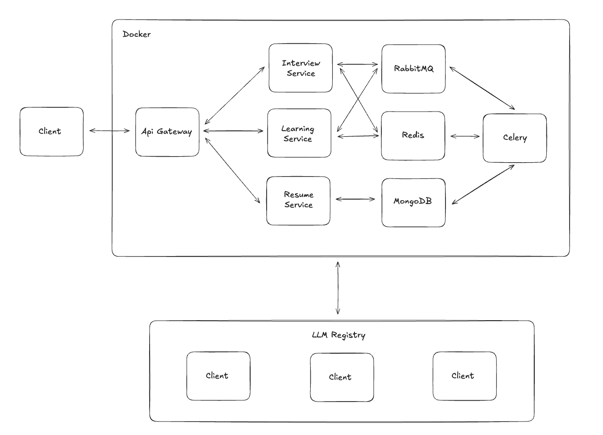

# 시스템 아키텍처

> AI Challenge - Interview Preparation API의 시스템 아키텍처 및 설계 원칙

## 시스템 아키텍처 



## 아키텍처 구성 요소

### **마이크로서비스 (FastAPI)**
- **Resume Service (Port 8001)**: 이력서 CRUD 관리
- **Interview Service (Port 8002)**: AI 기반 면접 질문 생성
- **Learning Service (Port 8003)**: AI 기반 학습 경로 생성

### **Shared Module**
- **LLM Registry**: 다중 AI 모델 관리 및 폴백 처리
- **Database Connection**: MongoDB 연결 풀 관리
- **Common Utilities**: 공통 로깅, 에러 처리, 설정 관리

### **데이터 레이어**
- **MongoDB**: 유연한 스키마로 다양한 이력서 형태 지원
- **Collections**: resumes, interviews, learning_paths

### **AI 레이어**
- **OpenAI GPT-3.5**: 빠르고 일관된 품질의 기본 모델
- **Claude 3.5 Sonnet**: 창의적이고 상세한 고품질 응답
- **Gemini 1.5 Flash**: 무료 모델로 비용 최적화

### **비동기 처리 레이어**
- **Celery**: 백그라운드 작업 큐 시스템으로 LLM 작업 처리
- **RabbitMQ**: 메시지 브로커로 작업 큐 관리
- **Redis**: Celery 결과 백엔드 및 진행률 추적
- **SSE (Server-Sent Events)**: 실시간 진행률 업데이트

### **인프라 레이어**
- **Docker Compose**: 로컬 개발 환경 통합 관리
- **Traefik**: API Gateway 기반 라우팅 및 로드밸런싱

## 데이터 흐름 (Data Flow)

### **동기 처리 (Synchronous)**
1. **이력서 등록**: Client → Resume Service → MongoDB
2. **면접 질문 생성 (동기)**: Client → Interview Service → LLM → MongoDB

### **비동기 처리 (Asynchronous)**
1. **면접 질문 생성 (비동기)**:
   - Client → Interview Service → Celery Task → RabbitMQ Queue
   - Celery Worker → LLM API → MongoDB
   - 진행률 추적: Redis → SSE → Client (실시간 업데이트)

2. **학습 경로 생성 (비동기)**:
   - Client → Learning Service → Celery Task → RabbitMQ Queue
   - Celery Worker → LLM API → MongoDB
   - 진행률 추적: Redis → SSE → Client (실시간 업데이트)

3. **폴백 처리**: LLM 실패 시 자동으로 다른 Provider로 전환
4. **실시간 모니터링**: Flower Dashboard로 Celery 작업 상태 확인

## 기술 스택 선정 이유

### **FastAPI (Python)**
- **비동기 처리**: async/await 지원으로 I/O 바운드 작업 최적화
- **생태계**: LangChain, OpenAI SDK 등 AI 라이브러리와 완벽 호환

### **MongoDB**
- **스키마 유연성**: 다양한 형태의 이력서 데이터 저장
- **JSON 친화적**: FastAPI와 자연스러운 통합
- **확장성**: 샤딩 및 레플리카셋 지원

### **Celery (작업 큐)**
- **비동기 처리**: LLM API 호출같은 시간이 오래 걸리는 작업을 백그라운드에서 처리
- **분산 처리**: 여러 워커에서 병렬로 작업 실행 가능
- **재시도 메커니즘**: 실패한 작업 자동 재시도로 안정성 보장
- **Python 생태계**: FastAPI와 완벽한 통합

### **RabbitMQ (메시지 브로커)**
- **안정성**: 메시지 지속성(persistence)으로 작업 손실 방지
- **라우팅**: 복잡한 메시지 라우팅 패턴 지원
- **확장성**: 클러스터링으로 고가용성 구현
- **표준 준수**: AMQP 프로토콜 기반으로 언어 독립적

### **Redis (결과 백엔드 & 캐시)**
- **고성능**: 인메모리 저장으로 빠른 응답 속도
- **진행률 추적**: 실시간 작업 상태 및 진행률 저장
- **결과 캐싱**: Celery 작업 결과의 임시 저장소
- **SSE 지원**: 실시간 클라이언트 알림을 위한 데이터 소스

## 확장성을 고려한 아키텍처 설계: MSA

### 현재 구현된 마이크로서비스 구조:

```
backend/
├── shared/                    # 공통 모듈
│   ├── config/base.py            # 통합 설정 관리
│   ├── database/connection.py    # MongoDB 연결 관리
│   ├── llm/                      # LLM 클라이언트 추상화
│   │   ├── base.py              # 추상 기본 클래스
│   │   ├── openai_client.py     # OpenAI GPT 클라이언트
│   │   ├── claude_client.py     # Anthropic Claude 클라이언트
│   │   ├── gemini_client.py     # Google Gemini 클라이언트
│   │   └── registry.py          # LLM 레지스트리 & 폴백
│   └── utils/                   # 공통 유틸리티
│
├── resume-service/            # 이력서 관리 서비스
│   ├── src/routes.py            # REST API 엔드포인트
│   ├── src/crud.py              # 데이터베이스 CRUD
│   └── main.py                  # 서비스 엔트리포인트
│
├── interview-service/         # 면접 질문 생성 서비스
│   ├── src/routes.py            # REST API 엔드포인트
│   ├── src/service.py           # 비즈니스 로직
│   ├── src/crud.py              # 데이터베이스 CRUD
│   └── main.py                  # 서비스 엔트리포인트
│
└── learning-service/          # 학습 경로 생성 서비스
    ├── src/routes.py            # REST API 엔드포인트
    ├── src/service.py           # 비즈니스 로직
    └── main.py                  # 서비스 엔트리포인트
```

### MSA 설계 원칙:
1. **단일 책임**: 각 서비스는 하나의 비즈니스 도메인만 담당
2. **데이터 독립성**: 각 서비스가 독립적인 데이터베이스 접근
3. **API 게이트웨이**: Traefik 기반 라우팅 및 로드밸런싱
4. **서비스간 통신**: REST API 기반 (향후 gRPC 고려)
5. **공통 모듈**: shared 폴더로 코드 재사용성 극대화

## 통합 테스트 환경

### **테스트 페이지 (`http://api.localhost/test`)**
- **통합 테스트 UI**: 브라우저에서 바로 접속하여 전체 기능 테스트
- **서비스 선택**: Interview (면접 질문) / Learning (학습 경로) 서비스 전환
- **실시간 진행률**: SSE를 통한 실시간 작업 진행 상황 모니터링
- **결과 시각화**: 생성된 면접 질문 및 학습 경로의 구조화된 표시

### **모니터링 도구**
- **Flower Dashboard**: `http://localhost:5555` (Celery 작업 모니터링)
- **Traefik Dashboard**: `http://localhost:8080` (API Gateway 라우팅 상태)
- **API 문서**: 각 서비스별 Swagger UI 제공

### **비동기 API 엔드포인트**
```
POST /api/v1/interview/async/{unique_key}/questions   # 비동기 면접 질문 생성
GET  /api/v1/interview/tasks/{task_id}/progress       # 진행률 확인
GET  /api/v1/interview/tasks/{task_id}/stream         # SSE 스트림

POST /api/v1/learning/async/{unique_key}/learning-path  # 비동기 학습 경로 생성  
GET  /api/v1/learning/tasks/{task_id}/progress          # 진행률 확인
GET  /api/v1/learning/tasks/{task_id}/stream            # SSE 스트림
```
